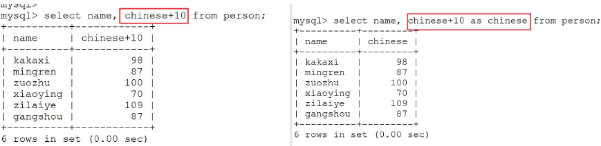
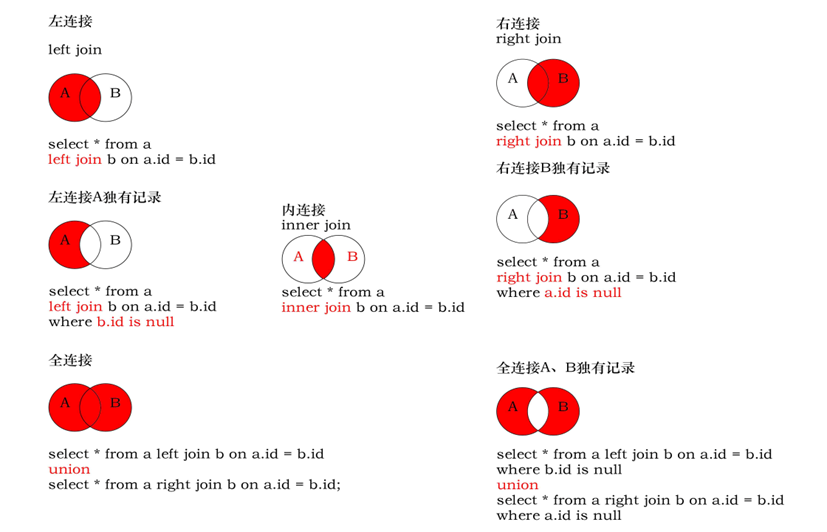

# 数据库的分类
* 关系型数据库
采用了关系模型来组织数据的数据库，其以行和列的形式存储数据。
关系型数据库把复杂的数据结构归结为简单的二元关系，在存储数据时实际就是采用的一张二维表。
Oracle MySQL SQL Server Access SQLite
* 非关系型数据库
为了解决大规模数据集合多重数据种类带来的挑战，特别是大数据应用难题。
Redis MongoDB LevelDB


# SQL简介
SQL：Structured Query Language 
中文名称：结构化查询语言
* DDL(数据定义语言)
* DML(数据操作语言)
* DQL(数据查询语言)

# DDL 数据定义语言
* 用于描述数据库中要存储的现实世界实体的语言。即创建数据库和表的结构。
* 常用关键字：
CREATE ALTER DROP TRUNCATE

## 创建数据库
```sql
CREATE {DATABASE | SCHEMA} [IF NOT EXISTS] db_name
    [create_specification [, create_specification] ...]
create_specification:
[DEFAULT] CHARACTER SET charset_name //指定字符集
[DEFAULT] COLLATE collation_name //指定字符集比较方式
```

## 查看、删除数据库
显示数据库语句：
SHOW DATABASES;

显示数据库创建语句：
SHOW CREATE DATABASE db_name;

数据库删除语句：
DROP DATABASE  [IF EXISTS]  db_name;

## 修改、备份、恢复数据库
```sql
ALTER  DATABASE  [IF NOT EXISTS] db_name 
    [alter_specification ] [alter_specification] ...] 
alter_specification:    
    [DEFAULT] CHARACTER SET charset_name  
|   [DEFAULT] COLLATE collation_name
```


* 备份
在终端之下 $mysqldump -u root -p 43th>43th.sql
* 恢复
先要在mysql服务器上先创建一个空的数据库
1.在命令行之下: $ mysql -u root -p 43th<43th.sql
2.进入mysql之后:
mysql > use 43th;
mysql > source 43th.sql;

## 数据类型

* VARCHAR、BLOB和TEXT类是变长类型
* TimeStamp表示时间戳，它可用于自动记录insert、update操作的时间

## 创建表
```sql
CREATE TABLE table_name
(
	field1  datatype,
	field2  datatype,
	field3  datatype
)[character set 字符集 collate 校对规则]
field：指定列名　datatype：指定列类型
```
* 注：创建表前先使用use db语句使用库。

## 查看表结构
* show create table tName;
* desc tName;


## 修改表结构
使用 ALTER TABLE 语句  追加, 修改, 或删除列的语法

1. 添加列(字段)
**alter** table tName **add** field datatype;
2. 对字段名进行修改
**alter** table tName **change** field1 fied2 datatype;
对字段名的类型进行修改
**alter** table tName **modify** field datatype;
3. 删除一个字段
**alter** table tName **drop** field;

## 修改、删除表
1. 修改表的名称
Rename table 表名 to 新表名
2. 删除表
drop table tName;

# DML 数据操纵语言
* 用于向数据库表中插入、删除、修改数据。
* 常用关键字：
INSERT UPDATE DELETE

1. 在表中插入记录
insert
2. 修改某些列的数据
update
3. 删除
delete

## Insert语句
使用 INSERT 语句向表中插入数据
* 对指定列进行数据的添加(一行)
**insert into** TName(field1, field2,...)**values**(fiedl1Value, field2Value);
* 对所有列都进行数据的添加（一行）
**insert into** TName**values**(field1Value, field2Value, ...);
* 对指定列进行数据的添加(多行)
**insert into** TName(field1, field2,...)**values**(fiedl1Value, field2Value),(filed1Value, field2Value), ...;
* 对所有列都进行数据的添加（多行）
**insert into** TName **values**(field1Value, field2Value, ...),（filed1Value, field2Value），...;
* 插入的数据应与字段的数据类型相同
* 数据的大小应在列的规定范围内
* 在values中列出的数据
* 字符和日期型数据应包含在单引号中
* 插入空值，不指定或insert into table value(null)


## Update语句
使用 update语句修改表中数据
```sql
UPDATE 	tbl_name    
	SET col_name1=expr1 [, col_name2=expr2 ...]    
	[WHERE where_definition]    
```
* SET子句指示要修改哪些列和要给予哪些值
* WHERE子句指定应更新哪些行,如没有WHERE子句，则更新所有的行


## Delete语句
使用 delete语句删除表中数据
delete from  table_name       
	[WHERE where_definition] 

* 不使用where子句，将删除表中所有数据
* Delete语句不能删除某一列的值（可使用update）
* 使用delete语句仅删除记录，不删除表本身，表结构还存在。如要删除表，使用drop table语句
* 同insert和update一样，从一个表中删除记录将引起其它表的参照完整性问题，在修改数据库数据时，头脑中应该始终不要忘记这个潜在的问题

复制表
* 复制表结构（并不复制数据）
create table newTName like oldTName;
* 复制表结构和数据
create table newTName select * from oldTName;

# DQL 简单查询
* 用于查询数据。
* 常用关键字：
SELECT

## 基本select语句
```sql
SELECT [DISTINCT] [* ] |{column1, column2..}
FROM    table [where ];
```
* Select 指定查询哪些列的数据
* column指定列名
* \* 代表查询所有列
* From指定查询哪张表
* DISTINCT可选，指显示结果时，是否剔除重复数据

## select表达式
* 在select语句中可使用表达式对查询的列进行运算
SELECT *|{column1｜expression, column2｜expression，..} FROM	table;
* 使用as还可以对某些列取别名
SELECT column as 别名 from 表名;


## where子句过滤查询
* 在where子句中经常使用的运算符


* 比较运算符 > < <= >= = <> 
* 范围查找(含头尾) between .. and ..
* 枚举查询 in 显示在in列表中的值
* 模糊查询 like 通配符：%表示零或多个任意字符，_代表一个字符


## order by 子句排序查询结果
```sql
SELECT column1, column2. column3..
	FROM	table;
	order by column asc|desc
```
* Order by 指定排序的列，排序的列即可是表中的列名，也可以是select 语句后指定的列名
* Asc 升序、Desc 降序 默认升序
* ORDER BY 子句位于SELECT语句的结尾
* limit limit 3; limit 3 offset 0;

分页查询
1. limit m,n - m 偏移数，n 显示条数
2. limit n offset m - m 偏移数，n 显示条数

# DQL 复杂查询

## 连接查询
涉及到多张表
交叉连接、内连接、外连接
```sql
Select * from T1 join_type T2 
[on (join_condition)][where (query_condition)]
```
* T1和T2表示参与连接操作的表，T1为左表，T2为右表
* on子句设定连接条件
* where子句设定查询条件
* join_type表示连接类型



### 交叉连接
交叉连接(cross join):不带on子句，返回连接表中所有数据行的笛卡儿积。

* select * from LT cross join RT; [笛卡尔积]
* select * from LT join RT;
* select * from LT, RT; [隐式写法]

### 内连接
内连接（inner join）：返回连接表中符合连接条件及查询条件的数据行。

显式内连接：使用inner join关键字，在on子句中设定连接条件
隐式内连接：不包含inner join关键字和on关键字，在where子句中设定连接条件

### 外连接
外连接：分为左外连接、右外连接。
与内连接不同的是，外连接不仅返回连接表中符合连接条件及查询条件的数据行，也返回左表（左外连接时）或右表（右外连接时）中仅符合查询条件但不符合连接条件的数据行。

* 左外连接 使用left outer join关键字，在on子句中设定连接条件
带查询条件的左外连接查询，在where子句中设定查询条件
* 右外连接 使用right outer join关键字，在on子句中设定连接条件
带查询条件的右外连接查询，在where子句中设定查询条件

## 子查询
子查询也叫嵌套查询，是指在where子句或from子句中又嵌入select查询语句（一般写在where子句）

## 联合查询
联合查询能够合并两条查询语句的查询结果，去掉其中的重复数据行，然后返回没有重复数据行的查询结果。联合查询使用union关键字

注：联合查询的各子查询使用的表结构应该相同，同时两个子查询返回的列也应相同。

## 报表查询
报表查询对数据行进行分组统计
```sql
select … from … [where…]
[group by …[having… ]]
[order by …] 
```
group by 子句指定按照哪些字段分组
having 子句设定分组查询条件

当分组之后， 还需要对记录进行过滤，只能使用having子句不能使用where子句；where子句在没有分组之前使用

## 常用统计函数
* count() 计数
Count(列名)返回某一列行的总数
* sum() 求和
Sum函数返回满足where条件行的和
* avg() 求平均值
AVG函数返回满足where条件的一列的平均值
* max()/min() 最大值 最小值
Max/min函数返回满足where条件的一列的最大/最小值

# 数据完整性
数据完整性是为了保证插入到数据库中的数据是正确的，它防止了用户可能的输入错误。
数据完整性主要分为以下三类：
实体完整性、域完整性、参照完整性

## 实体完整性
规定表的一行（即每一条记录）在表中是唯一的实体。实体完整性通过表的主键来实现。
* 主键：PRIMARY KEY 不允许为空，不允许重复
* auto_increment ：主键自动增长，不需要手动添加

删除主键约束有两步
* 一般情况下，一张表只有一个主键
1. Alter table TName modify field datatype; 去掉自动增长的约束
2. Alter table TName drop primary key; 删除主键约束

* 联合主键
对于某一张表，一条记录的唯一性由两个或者以上的字段共同决定
只要其中之一不相同，就是一条不同的记录
primary key(key1,key2);

## 域完整性
指数据库表的列（即字段）必须符合某种特定的数据类型或约束。

* 非空约束： NOT NULL 该字段不能为空
* 唯一约束： UNIQUE 该字段不允许重复，允许为空
* 删除唯一约束 先获取唯一约束的名字，之后再drop掉
alter table TName drop INDEX name;

## 参照完整性
保证一个表的外键和另一个表的主键对应。

* 外键约束：FOREIGN KEY，外键是另外一张表的主键
* 表已经存在的情况下，需要使用alter
alter table TName
add CONSTRAINT fk_1 FOREIGN KEY(s_id) REFERENCES student(id);
* 表不存在的情况下，设置外键

* 删除外键 先查找外键的名字，直接删除 alter table TName drop FOREIGN KEY fk_1;

# C语言的API
C语言常用API


## 初始化
* mysql_init
MYSQL *mysql_init(MYSQL *mysql)
分配或初始化MYSQL对象
返回值：初始化的MYSQL\*句柄，如无足够内存以分配新的对象，返回NULL

## 建立连接并查询
* mysql_real_connect
建立连接
* mysql_query
int mysql_query(MYSQL *mysql,const char *query)
进行查询，执行query字符串中的SQL语句
* mysql_real_query

## 获取查询结果
* mysql_use_result
MYSQL_RES *mysql_use_result(MYSQL *mysql)
use 不会直接保存查询结果
* mysql_store_result
MYSQL_RES *mysql_store_result(MYSQL *mysql)
store 会直接把所有的查询结果存储下来
* mysql_fetch_row
MYSQL_ROW mysql_fetch_row(MYSQL_RES *result)
检索结果集的下一行

## 释放结果集和关闭连接
* mysql_free_result
void mysql_free_result(MYSQL_RES *result)
释放结果集
* mysql_close
void mysql_close(MYSQL *mysql)
关闭连接

```c
#include<mysql/mysql.h>
#include<stdio.h>

int main(){
    MYSQL * conn = NULL;
    char * host = "localhost";
    char * user = "root";
    char * passwd = "123456";
    char * db = "43th";

    // 1.初始化mysql的链接句柄
    conn = mysql_init(NULL);

    // 2.建立连接(TCP的连接，完成三次握手的过程，信息的校验)
    if(mysql_real_connect(conn,host,user,passwd,db,3306,NULL,0) == NULL) {
        printf("error:%s\n",mysql_error(conn));
        return EXIT_FAILURE;
    }
    
    // 3.执行查询
    char * query = "select * from person";
    int ret = mysql_query(conn,query);
    if(ret != 0){
        printf("error query1:%s\n", mysql_error(conn));
        return EXIT_FAILURE;
    }

    // 4.获取结果集,N行数据
    // mysql_use_result 不会直接保存查询结果
    // MYSQL_RES * result = mysql_use_result(conn);
    // mysql_store_result 会直接把所有结果存储下来
    MYSQL_RES * result = mysql_store_result(conn);
    if(result == NULL){
        printf("error query2:%s\n", mysql_error(conn));
        return EXIT_FAILURE;
    }

    int rows = mysql_num_rows(result);
    int cols = mysql_num_fields(result);
    printf("rows:%d, cols:%d\n",rows, cols);

    // 5.获取每一行数据
    MYSQL_ROW row;
    while((row = mysql_fetch_row(result)) != NULL){
        for(int i = 0; i < cols; ++i){
            printf("%10s",row[i]);
        }
        printf("\n");
    }

    // 6.释放结果集和关闭连接
    mysql_free_result(result);
    mysql_close(conn);

    return 0;
}

```


